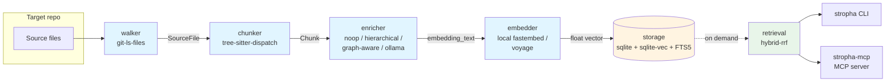
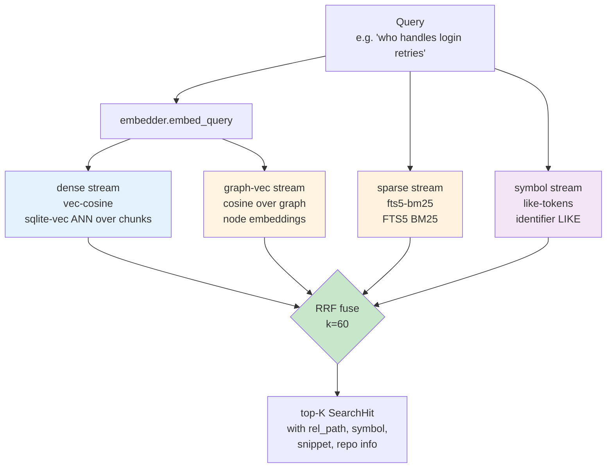
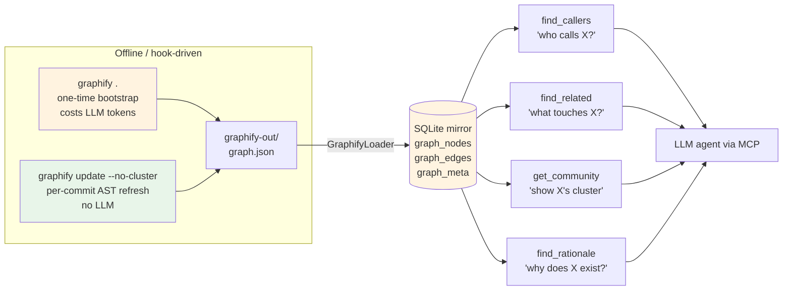
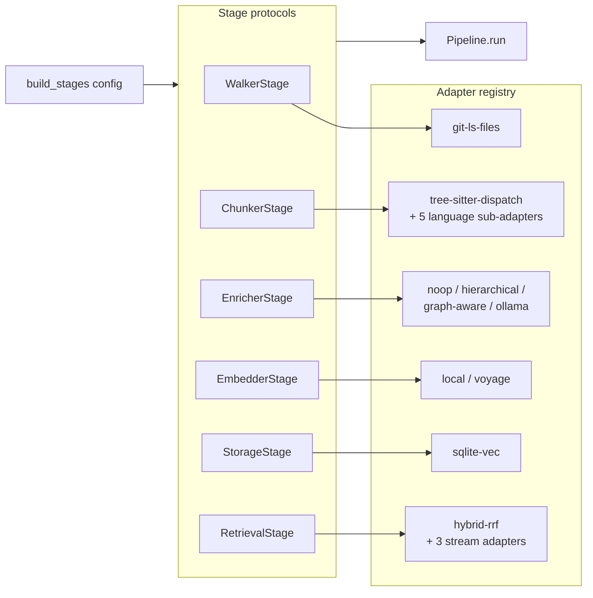
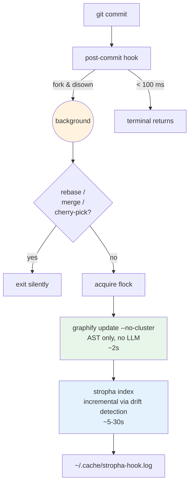

# stropha

> A local-first **RAG over your codebase**, exposed to any LLM via the
> [Model Context Protocol (MCP)](https://modelcontextprotocol.io). Tree-sitter
> AST chunking, three-stream hybrid retrieval (dense + BM25 + symbol),
> graph-aware tools (`find_callers`, `find_rationale`, …), and a swappable
> adapter framework so every stage of the pipeline is pluggable.

[](#evaluation)
[](#requirements)
[](#license)

---

## Table of contents

- [Why stropha](#why-stropha)
- [Key features](#key-features)
- [Quick start](#quick-start)
- [Installation](#installation)
- [How it works](#how-it-works)
  - [Indexing pipeline](#indexing-pipeline)
  - [Hybrid retrieval](#hybrid-retrieval)
  - [Graphify integration](#graphify-integration)
- [MCP integration](#mcp-integration)
- [CLI reference](#cli-reference)
- [Adapter system](#adapter-system)
- [Configuration](#configuration)
- [Post-commit automation](#post-commit-automation)
- [Evaluation](#evaluation)
- [Development](#development)
- [Roadmap](#roadmap)
- [License](#license)

---

## Why stropha

Most RAG tools are tuned for prose. Code needs different handling: function
boundaries are real semantic units, identifiers carry information that
embeddings dilute, and the "why" of a piece of code lives in commits and
docs that no embedding model has seen.

**stropha** fixes that with three combined strategies:

1. **Structural chunking** — tree-sitter splits each file into class /
   function / method nodes. Skeleton chunks preserve the parent context
   (class signature + sibling list) so a method embedding still knows where
   it lives.
2. **Three-stream retrieval** — every query hits a dense vector index
   (`sqlite-vec`), a BM25 full-text index (`FTS5`), and a symbol-token
   index in parallel. Results are fused via Reciprocal Rank Fusion (RRF).
   No single stream dominates, no expensive reranker needed for the
   common case.
3. **Graph-aware tools** — when a [graphify](https://github.com/safishamsi/graphify)
   graph is present, stropha mirrors it into SQLite and exposes
   `find_callers`, `find_related`, `get_community`, `find_rationale` as
   first-class MCP tools. Structural questions ("who calls X?", "what doc
   explains Y?") get exact answers, not best-effort search hits.

Local-first: zero network calls in the default path. Optional Voyage AI
embedder if you want premium quality.

## Key features

| Capability | Status |
|---|---|
| Tree-sitter AST chunking (Python, TS/JS, Java, Kotlin, Go, Rust) | ✅ |
| Custom chunkers (Vue SFC, Markdown headings, Gherkin features) | ✅ |
| Hybrid retrieval — **4 streams** (dense + BM25 + symbol + graph-vec) fused via RRF | ✅ |
| Class skeletons preserve parent context | ✅ |
| Multi-repo indexing — `--repo` flags or declarative `--manifest repos.yaml` | ✅ |
| Drift detection — config change ⇒ re-embed only what changed | ✅ |
| Pluggable adapter framework — every stage swappable via YAML | ✅ |
| Walkers: `git-ls-files`, `filesystem`, `nested-git` (monorepos) | ✅ |
| Enrichers: `noop`, `hierarchical`, `graph-aware`, `ollama`, `mlx` | ✅ |
| Graphify mirror + **5 graph traversal MCP tools** (`find_callers`, `find_related`, `get_community`, `find_rationale`, `trace_feature`) | ✅ |
| Post-commit hook (`stropha hook install`) — auto-refresh in background | ✅ |
| Offline eval harness (Recall@K + MRR over a JSONL golden set) | ✅ |
| Local LLM enrichers: Ollama (HTTP) and MLX (Apple Silicon native) | ✅ |
| File-watcher soft index | ⏳ planned |
| OpenTelemetry tracing | ⏳ planned |
| Voyage `rerank-2.5` reranker stage | ⏳ planned (cloud) |
| Contextual Retrieval (Anthropic) | ⏳ planned (cloud) |

## Quick start

```bash
# 1. Install (Python 3.12+, uv recommended)
git clone https://github.com/JonatasFischer/stropha.git
cd stropha
uv sync

# 2. Index a repo (defaults to current directory)
uv run stropha index --repo /path/to/your/code

# 3. Search
uv run stropha search "where does authentication live"

# 4. Inspect the index
uv run stropha stats

# 5. Wire it into Claude Code / Cursor / OpenCode (see "MCP integration")
```

That's it for read-only RAG. To go further:

```bash
# Bootstrap the symbol graph (one-time, costs LLM tokens once)
graphify .

# Install the post-commit hook so future commits keep the index fresh
uv run stropha hook install

# Validate the resolved pipeline composition
uv run stropha pipeline validate
```

## Installation

### Requirements

- Python **3.12+**
- [`uv`](https://github.com/astral-sh/uv) (recommended) or `pip`
- A C compiler (only if you build sqlite-vec from source on exotic platforms)

### Via uv (recommended)

```bash
git clone https://github.com/JonatasFischer/stropha.git
cd stropha
uv sync
uv run stropha --help
```

### Via pip / pipx

```bash
pip install -e .
stropha --help
```

### Optional dependencies

| Component | Install | Purpose |
|---|---|---|
| Voyage AI embedder | export `VOYAGE_API_KEY=...` | premium code embeddings (`voyage-code-3`) |
| Graphify | `pipx install graphifyy` | symbol graph for `find_callers` / `find_rationale` / `trace_feature` |
| Ollama | `brew install ollama` + `ollama pull qwen2.5-coder:1.5b` | local LLM enricher via HTTP — works on any platform |
| MLX (Apple Silicon) | `uv sync --extra mlx` | native LLM enricher in-process, ~1.5-2× faster than Ollama on M-series |

## How it works

### Indexing pipeline

Six stages, each a swappable adapter. The default composition is shown
below; every stage is pluggable via `pipeline show` / `--enricher` /
`--embedder` / `stropha.yaml`.



Each chunk is hashed (`content_hash`) and tagged with the active
`(embedding_model, enricher_id)`. On the next `stropha index`, chunks
whose triplet matches the active config are skipped — **changing an
adapter automatically triggers re-processing only of the affected
chunks** (drift detection, ADR-004).

### Hybrid retrieval

Every query can hit up to **four streams in parallel** and the results
are fused with Reciprocal Rank Fusion (RRF). No single stream dominates.



Why four streams:

- **Dense** — semantic similarity over chunks, catches paraphrases ("retry policy" vs "exponential backoff")
- **BM25** — exact phrase matching, handles literal terms the embedder smooths over
- **Symbol** — `LIKE`-based identifier match, surfaces things by their actual name (`StudyService.submitAnswer`)
- **Graph-vec** — semantic match against the graphify node labels (one
  per function/class), boosts recall for queries that name a concept the
  graph already labelled. Auto-disabled when no graph is loaded.

### Graphify integration

When the optional [graphify](https://github.com/safishamsi/graphify) tool
has produced `graphify-out/graph.json` for the repo, stropha mirrors it
into SQLite (`graph_nodes` / `graph_edges` / `graph_meta`) and exposes
four new MCP tools that traverse the graph in pure SQL.



Edges are filtered at load time by confidence
(`STROPHA_GRAPH_CONFIDENCE`, default `EXTRACTED` — the AST-derived,
zero-LLM-inference subset). The loader is **idempotent** and
**transactional**: re-running it produces the same DB state, and a
mid-load failure leaves the previous graph intact.

You can also use the **graph-aware enricher** (`--enricher graph-aware`),
which prepends the matching community label to every chunk's
`embedding_text`. This boosts BM25 recall on community-level queries
("where is the hybrid retrieval pipeline?") without any extra LLM cost.

## MCP integration

stropha ships an MCP server registered as **`stropha_rag`**. Any
MCP-compatible client (Claude Code, Cursor, Continue, OpenCode, …) can
connect to it.

### OpenCode

Already wired in `opencode.json`:

```json
{
  "$schema": "https://opencode.ai/config.json",
  "mcp": {
    "stropha_rag": {
      "type": "local",
      "command": ["uv", "--directory", "/abs/path/to/stropha", "run", "stropha-mcp"],
      "enabled": true,
      "env": {
        "STROPHA_TARGET_REPO": "/abs/path/to/your/code",
        "STROPHA_INDEX_PATH": "/abs/path/to/your/code/.stropha/index.db"
      }
    }
  }
}
```

### Claude Code / Claude Desktop

Add to your project's `.mcp.json`:

```json
{
  "mcpServers": {
    "stropha_rag": {
      "command": "uv",
      "args": ["--directory", "/abs/path/to/stropha", "run", "stropha-mcp"],
      "env": {
        "STROPHA_TARGET_REPO": "/abs/path/to/your/code"
      }
    }
  }
}
```

### Available MCP tools

| Tool | When the model should reach for it |
|---|---|
| `search_code(query, top_k)` | Free-text or conceptual queries ("how does mastery work?") |
| `get_symbol(symbol, limit)` | Known identifier — cheaper and exact (`FsrsCalculator`) |
| `get_file_outline(path)` | Plan a `Read` before consuming a whole file |
| `list_repos()` | Multi-repo indexes — show available sources |
| `find_callers(symbol)` | "Who calls X?" — needs graphify graph |
| `find_related(symbol)` | "What touches X?" — symmetric BFS, needs graph |
| `get_community(symbol)` | "Show me X's cluster" — pre-computed communities |
| `find_rationale(symbol)` | "Why does X exist?" — links code to docs/ADRs |
| `trace_feature(feature)` | "How does feature X flow through the code?" — DFS through `calls` edges from token-overlap entry points (Gherkin scenario → step → method) |

The five graph-aware tools return `{graph_loaded: false, ...}` with a
clear error message when no graphify graph is present, instead of failing
silently.

## CLI reference

```text
stropha index             # walk → chunk → enrich → embed → store
  --repo PATH             # repeatable (multi-repo)
  --manifest FILE         # YAML manifest with `repos: [{path, enabled}]`
                          # mutually exclusive with --repo
  --rebuild               # clear index first
  --enricher NAME         # noop | hierarchical | graph-aware | ollama | mlx
  --embedder NAME         # local | voyage

stropha search "QUERY"    # hybrid retrieval, prints top-K
  --top-k INT             # default 10

stropha stats             # index metadata, models, repos, graph status

stropha pipeline show     # resolved adapter composition + health
stropha pipeline validate # probe every adapter, exit non-zero on error

stropha adapters list     # enumerate registered adapters
  --stage NAME            # filter by stage

stropha hook install      # write post-commit hook (graphify + index refresh)
stropha hook uninstall    # remove our block, leave the rest of the file intact
stropha hook status       # report install state + version + log location

stropha eval              # run golden dataset, report Recall@K + MRR
  --golden PATH           # default tests/eval/golden.jsonl
  --top-k INT             # default 10
  --tag NAME              # filter cases by tag
  --json                  # machine-readable output
```

Run `stropha <command> --help` for the full option set.

## Adapter system

Every pipeline stage is an **Adapter** registered via the
`@register_adapter(stage=..., name=...)` decorator. Swap adapters with a
single CLI flag or a YAML config — no code changes.



Listing what's available right now:

```bash
$ stropha adapters list
    Available adapters
┏━━━━━━━━━━━━━━━━━━┳━━━━━━━━━━━━━━━━━━━━━━━━━━┓
┃ Stage            ┃ Adapter                  ┃
┡━━━━━━━━━━━━━━━━━━╇━━━━━━━━━━━━━━━━━━━━━━━━━━┩
│ chunker          │ tree-sitter-dispatch     │
│ embedder         │ local                    │
│ embedder         │ voyage                   │
│ enricher         │ graph-aware              │
│ enricher         │ hierarchical             │
│ enricher         │ mlx                      │
│ enricher         │ noop                     │
│ enricher         │ ollama                   │
│ retrieval        │ hybrid-rrf               │
│ retrieval-stream │ fts5-bm25                │
│ retrieval-stream │ graph-vec                │
│ retrieval-stream │ like-tokens              │
│ retrieval-stream │ vec-cosine               │
│ storage          │ sqlite-vec               │
│ walker           │ filesystem               │
│ walker           │ git-ls-files             │
│ walker           │ nested-git               │
└──────────────────┴──────────────────────────┘
```

Adding a new adapter is a self-contained file under
`src/stropha/adapters/<stage>/<name>.py`:

```python
from stropha.pipeline.registry import register_adapter
from stropha.stages.embedder import EmbedderStage

@register_adapter(stage="embedder", name="my-custom")
class MyEmbedder(EmbedderStage):
    Config = MyConfig  # Pydantic model
    # implement the protocol methods...
```

Drop it in, restart the CLI, `stropha adapters list` will show it.

## Configuration

Three layers, last writer wins (highest priority last):

1. **Repo defaults** — built into the registry
2. **YAML** — `./stropha.yaml` (per project) or `~/.stropha/config.yaml` (per user)
3. **Environment** — `STROPHA_<STAGE>__<KEY>__<SUBKEY>` (double-underscore separated)
4. **CLI flags** — `--enricher`, `--embedder`, `--repo`, …

### Example `stropha.yaml`

```yaml
pipeline:
  enricher:
    adapter: graph-aware
    config:
      include_community: true
      include_node_label: true
      include_parent_skeleton: true

  embedder:
    adapter: voyage
    config:
      model: voyage-code-3
      dim: 512  # truncates Matryoshka vector

  chunker:
    adapter: tree-sitter-dispatch
    config:
      languages:
        python: { adapter: ast-generic }
        typescript: { adapter: ast-generic }
        markdown: { adapter: heading-split }
        vue: { adapter: sfc-split }
        gherkin: { adapter: regex-feature-scenario }

  retrieval:
    adapter: hybrid-rrf
    config:
      k: 60
      streams:
        dense: { adapter: vec-cosine, config: { k: 50 } }
        sparse: { adapter: fts5-bm25, config: { k: 50 } }
        symbol: { adapter: like-tokens, config: { k: 50 } }
```

### Useful environment variables

| Variable | Effect |
|---|---|
| `STROPHA_TARGET_REPO` | Default repo for `index` / `mcp` |
| `STROPHA_INDEX_PATH` | Path to the SQLite index file |
| `VOYAGE_API_KEY` | Enables the Voyage embedder |
| `STROPHA_GRAPH_CONFIDENCE` | Comma-separated tiers to load (`EXTRACTED,INFERRED`) |
| `STROPHA_GRAPHIFY_OUT` | Override path to `graphify-out/` |
| `STROPHA_HOOK_SKIP=1` | Skip the post-commit hook (useful during rebases) |
| `STROPHA_HOOK_TIMEOUT=600` | Hook background process wall-clock timeout |
| `STROPHA_LOG_LEVEL` | `DEBUG` / `INFO` / `WARNING` |

## Post-commit automation

A single command installs a Git post-commit hook that keeps both the
graphify graph and the stropha index fresh on every commit, in detached
background, never blocking the commit:

```bash
stropha hook install
```

What the hook does:



Inspect with:

```bash
stropha hook status                   # is it installed? what version?
tail -f ~/.cache/stropha-hook.log    # what's running right now?
STROPHA_HOOK_SKIP=1 git commit ...    # bypass for one commit
stropha hook uninstall                # cleanly remove
```

The hook coexists with `husky` / `lefthook` (it honours `core.hooksPath`)
and with the `graphify hook` (warns and respects `--force`).

## Evaluation

```bash
stropha eval --top-k 10
```

Runs every case in `tests/eval/golden.jsonl` (~30 queries shipped) and
reports `Recall@K` + `MRR`, broken down per tag (`retrieval`, `graphify`,
`storage`, …). Exits with code 2 when `Recall@K < 0.85`, so you can drop
it straight into CI.

Add new cases by appending JSONL:

```jsonl
{"id": "auth-001", "query": "where is the login retry policy", "expected_paths": ["src/auth/retry.py"], "expected_symbols": ["LoginRetryPolicy"], "tags": ["auth", "retry"]}
```

Each case must include `query` plus at least one of `expected_paths`
(suffix match against `rel_path`) or `expected_symbols` (case-insensitive
dotted-suffix match against `symbol`).

## Development

```bash
# Test (217 unit tests, runs in ~5 s)
uv run pytest

# Lint
uv run ruff check src tests

# Type-check (gradual)
uv run mypy src/stropha

# Build the package
uv build
```

### Repository layout

```
src/stropha/
├── adapters/        # concrete stage implementations (auto-registered)
│   ├── chunker/     #   tree-sitter-dispatch + per-language sub-adapters
│   ├── embedder/    #   local (fastembed) + voyage
│   ├── enricher/    #   noop, hierarchical, graph-aware, ollama
│   ├── retrieval/   #   hybrid-rrf + 3 stream sub-adapters
│   ├── storage/     #   sqlite-vec
│   └── walker/      #   git-ls-files
├── pipeline/        # adapter framework: protocol, registry, builder, orchestrator
├── stages/          # Stage protocols (one per pipeline step)
├── ingest/          # legacy chunkers + git_meta + graphify_loader
├── retrieval/       # SearchEngine + RRF + graph traversal helpers
├── storage/         # SQLite + sqlite-vec backend
├── eval/            # golden-dataset harness (Recall@K + MRR)
├── tools/           # hook installer
├── cli.py           # Typer entry point — `stropha`
└── server.py        # FastMCP entry point — `stropha-mcp`

docs/architecture/   # full specs (system + adapters + graphify integration)
tests/unit/          # 200+ unit tests
tests/eval/          # golden JSONL files
graphify-out/        # generated graph snapshot (committed for agent use)
```

### Adding a new adapter

1. Pick a stage and a name: `src/stropha/adapters/embedder/my_thing.py`
2. Implement the protocol from `stropha.stages.embedder.EmbedderStage`
3. Decorate with `@register_adapter(stage="embedder", name="my-thing")`
4. Add tests under `tests/unit/test_my_thing.py`
5. `stropha adapters list --stage embedder` should show it

The auto-loader in `src/stropha/adapters/__init__.py` walks every submodule on import — no manual registration required.

## Roadmap

Tracked in `CLAUDE.md` (live state) and the spec docs:

- ✅ Phase 1 (MVP MCP)
- ✅ Pipeline-adapters Phase 1–4 (full adapter framework)
- ✅ Graphify integration Phase 1.5 (loader + 4 MCP tools + hook installer + L2 enricher)
- ✅ Trilha A L3 — graph node embeddings as a 4th RRF stream
- ✅ Phase 3 `trace_feature` tool (Gherkin → step → method)
- ✅ Phase 5 local enrichers — `ollama` and `mlx` shipped (no cloud required)
- ✅ Walker variants — `filesystem` (non-git) and `nested-git` (monorepos)
- ✅ Phase 4 declarative `--manifest` for multi-repo lists
- ✅ Phase 2 evaluation harness (offline Recall@K + MRR)
- ⏳ Phase 3 file-watcher soft index
- ⏳ Phase 2 OpenTelemetry tracing
- ⏳ Phase 4 storage backends (`lancedb` first — embedded; `qdrant`, `pgvector` later)
- ⏳ Phase 2 reranker (Voyage `rerank-2.5` — cloud)
- ⏳ Phase 2 Contextual Retrieval (Anthropic — cloud)

Full design discussion lives in:

- [`docs/architecture/stropha-system.md`](docs/architecture/stropha-system.md) — master spec (~57 KB)
- [`docs/architecture/stropha-pipeline-adapters.md`](docs/architecture/stropha-pipeline-adapters.md) — adapter framework ADR
- [`docs/architecture/stropha-graphify-integration.md`](docs/architecture/stropha-graphify-integration.md) — graphify integration RFC

## License

MIT — see [LICENSE](LICENSE) (if present) or the header in `pyproject.toml`.

---

> Originally built to give Claude Code precise local-first retrieval over
> the [Mimoria](https://github.com/anomalyco/mimoria) codebase, but
> repo-agnostic. Point `STROPHA_TARGET_REPO` anywhere.
